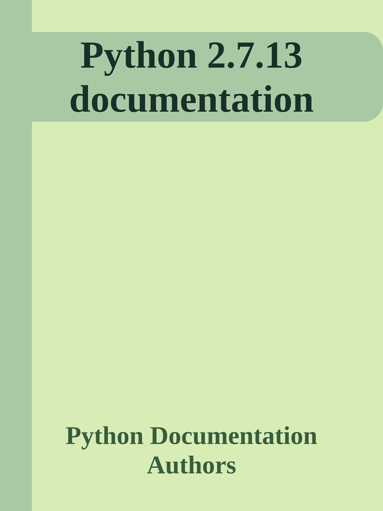
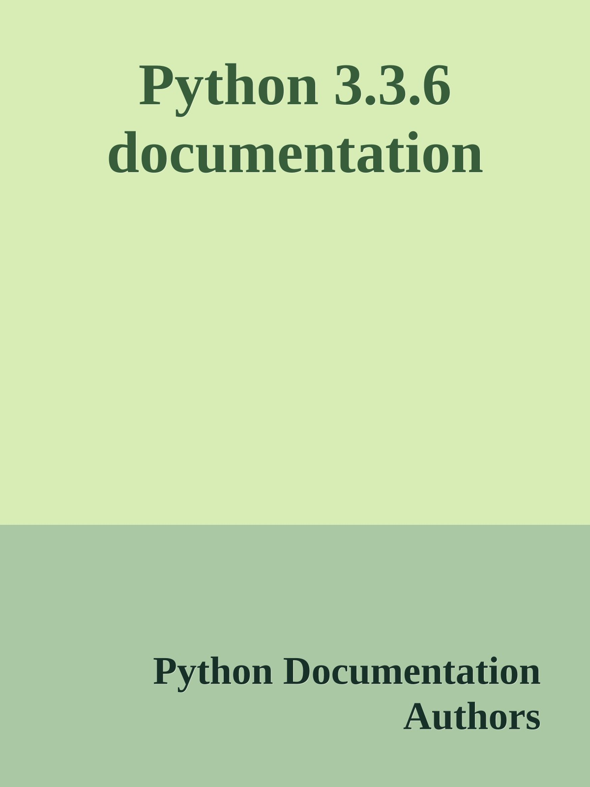
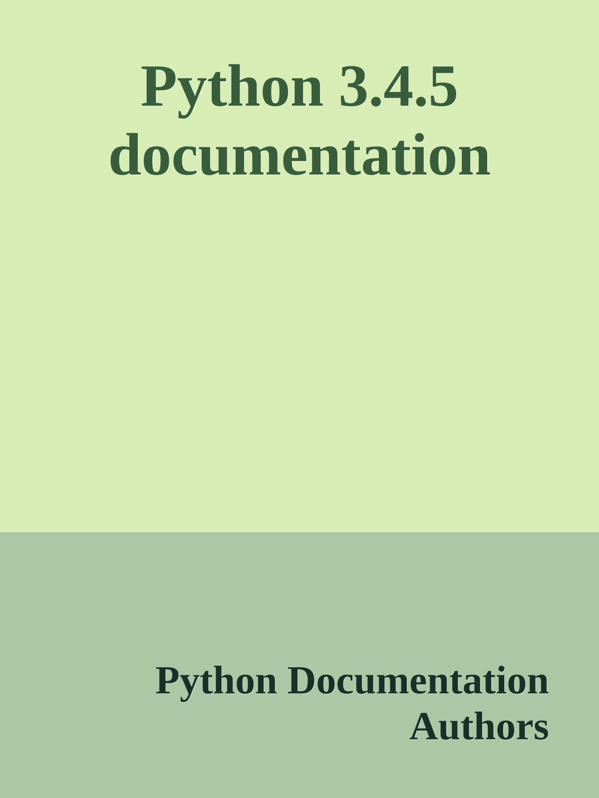
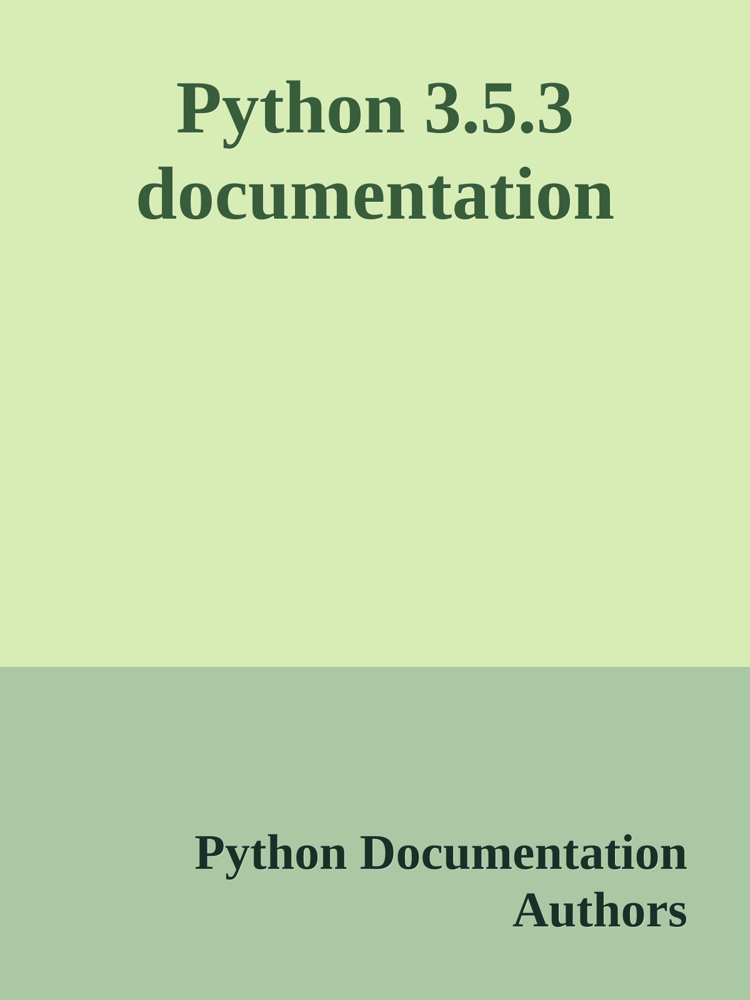
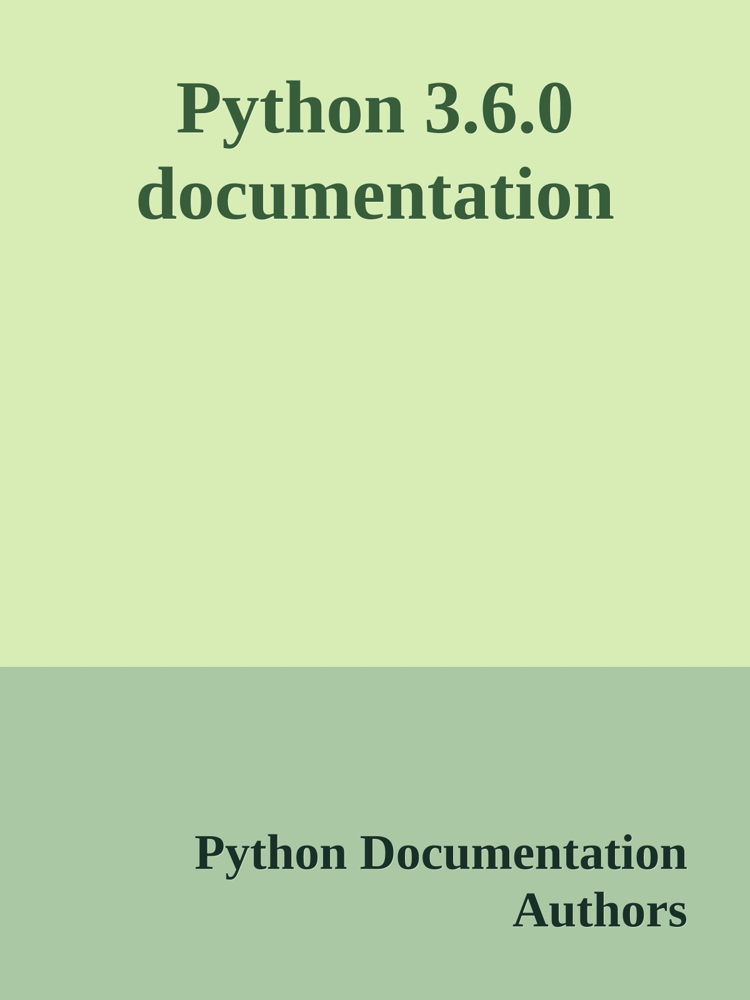
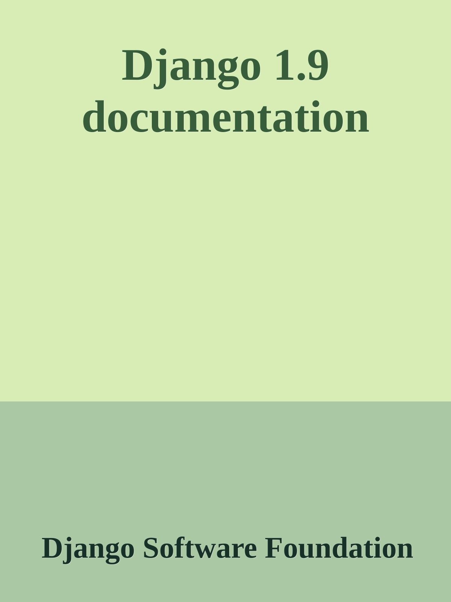
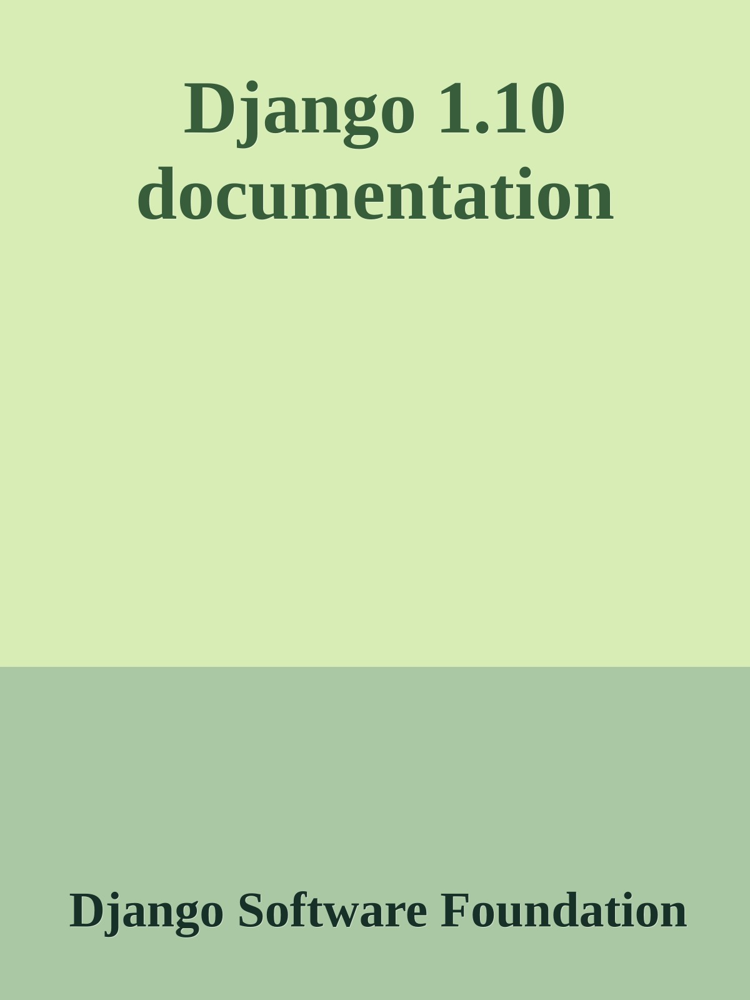
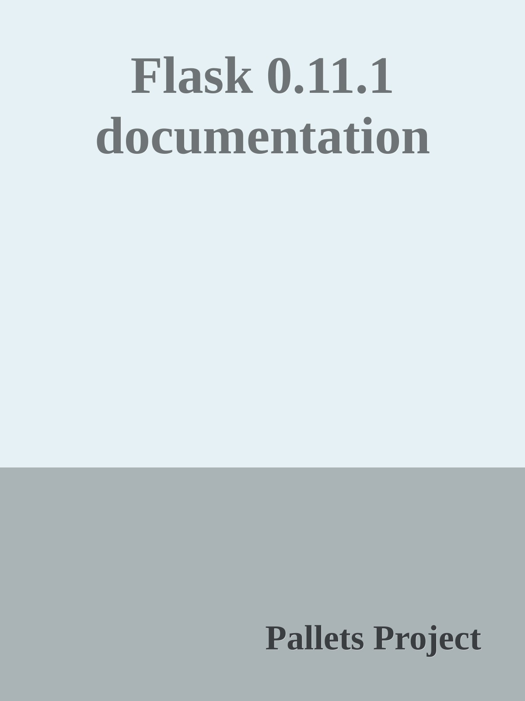
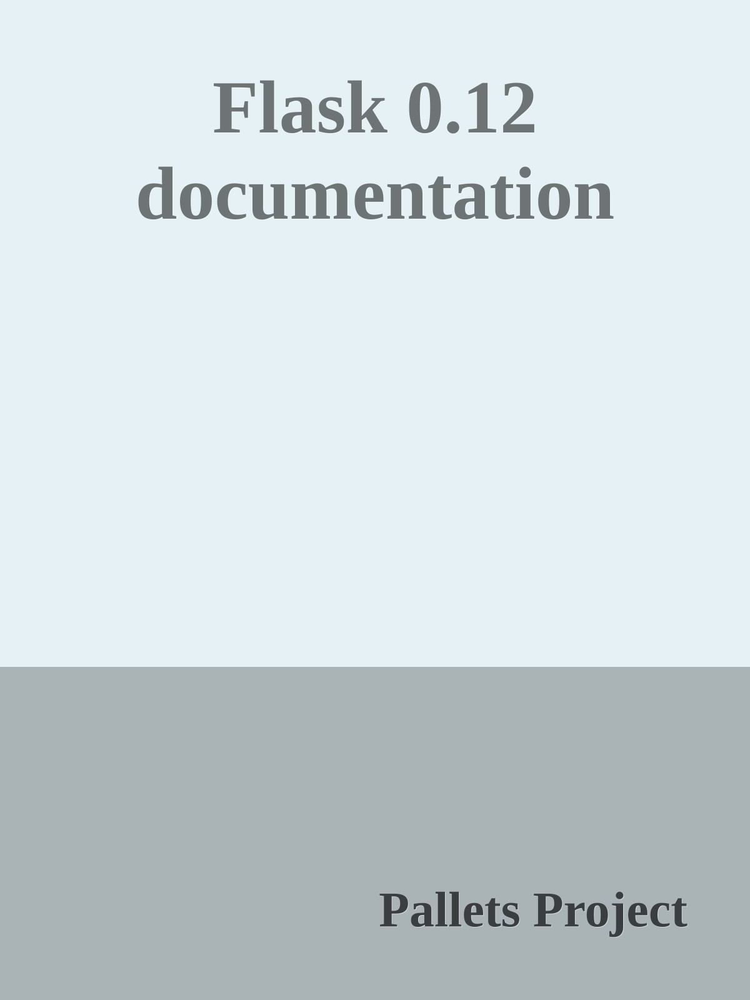

<h1 align="center">
  🐍 Python related docs as ebooks 📚
</h1>

  Python related docs in ebooks formats, such as .epub and Kindle (.azw3).

## Python Documentation
| Version | Epub     | Kindle     | Cover     |
| :------ | :------- | :--------- | :-------- |
| 2.7.13  | [.epub](ebooks/python/2.7.13/python_2_7_13.epub) | [.azw3](ebooks/python/2.7.13/python_2_7_13.azw3) | |
| 3.3.6   | [.epub](ebooks/python/3.3.6/python_3_3_6.epub) | [.azw3](ebooks/python/3.3.6/python_3_3_6.azw3) |  |
| 3.4.5   | [.epub](ebooks/python/3.4.5/python_3_4_5.epub) | [.azw3](ebooks/python/3.4.5/python_3_4_5.azw3) |  |
| 3.5.3   | [.epub](ebooks/python/3.5.3/python_3_5_3.epub) | [.azw3](ebooks/python/3.5.3/python_3_5_3.azw3) |  |
| 3.6.0   | [.epub](ebooks/python/3.6.0/python_3_6_0.epub) | [.azw3](ebooks/python/3.6.0/python_3_6_0.azw3) |  |

## Django Documentation
| Version | Epub     | Kindle     | Cover     |
| :------ | :------- | :--------- | :-------- |
| 1.8  | [.epub](ebooks/django/1.8/django_1_8.epub) | [.azw3](ebooks/django/1.8/django_1_8.azw3) |  |
| 1.9  | [.epub](ebooks/django/1.9/django_1_9.epub) | [.azw3](ebooks/django/1.9/django_1_9.azw3) |  |
| 1.10 | [.epub](ebooks/django/1.10/django_1_10.epub) | [.azw3](ebooks/django/1.10/django_1_10.azw3) |  |

## Flask Documentation
| Version | Epub     | Kindle     | Cover     |
| :------ | :------- | :--------- | :-------- |
| 0.11.1  | [.epub](ebooks/pallets-project/flask/0.11.1/flask_0_11_1.epub) | [.azw3](ebooks/pallets-project/flask/0.11.1/flask_0_11_1.azw3) |  |
| 0.12  | [.epub](ebooks/pallets-project/flask/0.12/flask_0_12.epub) | [.azw3](ebooks/pallets-project/flask/0.12/flask_0_12.azw3) |  |

## Requests Documentation
| Version | Epub     | Kindle     | Cover     |
| :------ | :------- | :--------- | :-------- |
| 2.13.0  | [.epub](ebooks/kennethreitz/requests/2.13.0/requests_2_13_0.epub) | [.azw3](ebooks/kennethreitz/requests/2.13.0/requests_2_13_0.azw3) |  |

## Contributing
Read [CONTRIBUTING.md](CONTRIBUTING.md).
